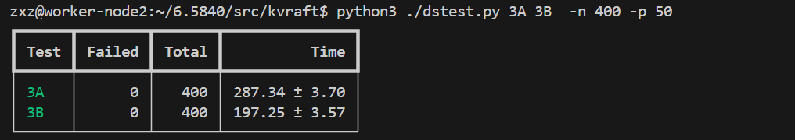
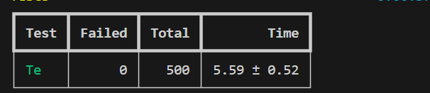
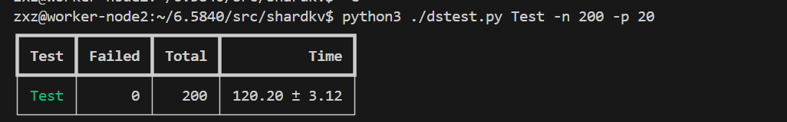
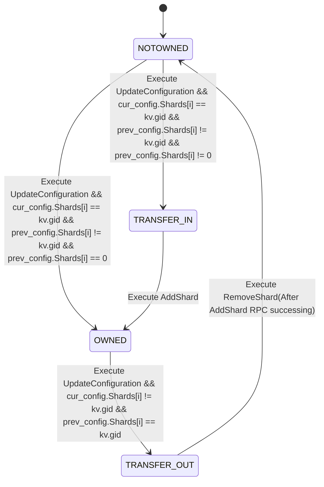

# My Solution for MIT 6.5840 2023
课程网站：http://nil.csail.mit.edu/6.5840/2023/schedule.html  
测试脚本来源：https://gist.github.com/JJGO/0d73540ef7cc2f066cb535156b7cbdab 
## Result
通过了所有测试（每个测试至少运行500次, 下面只放出一部分）
+ Lab 1

+ Lab 2

+ Lab 3

+ Lab 4A

+ Lab 4B



## Notes
### Lab 1
+ 记得在每次发送RPC前重置Reply。因为空值在RPC里会被压缩。如果不重置，server往reply里写的0会被压缩掉，client会在收到reply后保持原有值。

+ 用-race跑会报一些读写冲突，但不影响正确性。（只是可能分配已经完成的任务出去）

### Lab2
1. bug: 如果把ticker的唤醒间隔设置为10ms或更低，就无法通过LAB 2A many_election test，会大概率在某一阶段无法选出leader。  
解决办法：在resent rpc的循环中也休眠一段时间再发（可能是因为一些服务器disconnected以后，发送rpc的goroutine频繁重试，占用过多cpu时间）
2. 论文中的index从1开始，为了与其统一，我们使用一个{term:0, index:0}占掉log[0]。这在Lab 2D会遇到一些问题，但可以解决。
3. Optimization: commit有两种实现方法：一种是在commitIndex变化的时候由相应的AppendEntries或AppendEntriesReplyHandler向ApplyCh写，另一种是使用独立的goroutine轮询AppliedIndex是否和CommitIndex相等，不相等就commit。如果用第一种实现，在我的实现里偶尔会过不了Lab 2C TestUnreliableChurn2C，会报Fail to reach agreement的错。原因是我在前一种实现里把Lock加在了``ApplyCh<-msg``外面，实际上不应该把锁加在管道处理周围（可能因此需要wait，从而导致长时间选不出leader）
4. Optimization: 快速回退nextIndex的优化是必须做的（要不过不了Lab 2C）。https://thesquareplanet.com/blog/students-guide-to-raft/
5. bug: 如果AppendEntries里的PrevLogIndex小于LastSnapshotIndex，需要考虑怎么合理地返回参数。一个办法是额外加一个参数，然后让leader直接重传之后的所有Log（但是开销太大了）。实际上，这个prevlogindex过小的请求理论上是过时的（因为snapshot里都是已经commit的），所以可以直接返回LastIndex作为conflict index，让leader重新往回倒，这次必然不会倒到snapshot里面
6. bug: Lab 2C 即使在优化3和4过后，TestUnreliableChurn2C 依然小概率出现failed to reach agreement（大约1/50的概率)。而且这个现象往往在系统长时间go run test才会出现。

    + 原因分析：fail的直接原因是长期选不出leader（选出leader后马上有新的leader替换上来）。更根本的原因是我在实现里对每一个传输失败(Call返回false)的RPC都会不断重传直到重传成功或term改变，这导致了发送端的未成功的RPC积累，占据大量CPU时间/接收端需要花费大量CPU时间处理自己失联期间的请求。(考虑一个5个server的场景，0是leader，4被partitioned了，这期间失败的RPC请求数量增加，0需要不断重发，等到4 connect回来的时候它需要处理大量这之前的请求，这都要占用大量的CPU时间)
    + 优化1：减少ticker的唤醒频率，即follower或candidate下一次唤醒时间不应该小于min(timeout_time, now_time + heartbeattimeout)，而不需要用20ms的固定interval。但是这个办法没能解决问题。（实际上有可能小于，例如vote后reset_election_timeout的随机数恰好很小，就可能小于，但影响不大）
    + 优化2：减少commit_ticker的唤醒频率，从固定周期唤醒改成sync.Cond来做。没能解决问题。
    + 优化3：放弃RPC call fail的重传，解决了。因为需要重传的信息迟早会以别的方式到达，因此正确性可以保证；但这似乎不符合文章中“Servers retry RPCs if they do not receive a response in a timely manner”的要求。
    + **上面不本质。本质原因是我sendAppendEntries的时候直接写了for{}而不是for!killed{}。导致kill之后goroutine还一直存在，占用了大量memory和cpu。**
### Lab 3
+ linearizable和去重：使用一个goroutine（ApplyChReader）不断读ApplyCh，并且执行读出来的log，由于执行是单线程的，可以保证linearizable。Log重复没有关系，只要ApplyChReader读出来的时候检查一下是否重复，如果重复就不执行就可以。
+ 由于client是单线程的，所以如果server上client 1的request N已经被apply了，那么所有小于N的都已经被apply了（否则client就会处于重传小于N的request状态），因此如果这时候applyChReader从applyCh读出了一个小于N的operation，可以直接不管它。
+ 使用chan在server的RPC handler和ApplyChReader之间通信。对于每一个Operation，如果server此时是leader且这是当前client上最新的op，handler就会调用raft.Start（）开始append这个Log到raft，并且根据返回的Log Index创建一个chan。之后ApplyChReader从ApplyCh读出一个command时，会将结果写入其index对应的chan中。handler listen这个chan直到有结果，或者超时后返回ErrTimeout。
    + handler会确保执行结束后和start()开始的时候在同一个term，因此可以通过index唯一标识一个op。 
    + 这里我的实现如下，之所以使用指针是为了保证handler只会listen自己创建的chan，避免取走别的RPC handler的结果。
    ```
    	mychan := make(chan OpResult, 1)
        kv.mu.Lock()
        kv.chan_map[idx] = &mychan
        kv.mu.Unlock()
    ```
    + 如果有极小概率在TestManyPartitionsManyClients3A出现死锁的情况（我的实现约1/100），记得将chan开成buffer chan（即`mychan := make(chan OpResult, 1)` )。否则，对于unbuffered channel考虑下面一种时序：
    ```
    ApplyChReader lock
                            RpcHandler timeout(stop listening chan), waitting for lock
    ApplyChReader try to write chan(block)
    ```
    这种情况下ApplyChReader先拿锁，此时RPC handler恰好timeout了，handler想要拿锁去关闭chan，但是需要等ApplyHandler释放锁；ApplyChReader尝试写channel，但是因为RPC handler已经不listen了，写操作被block了，于是就死锁了。
+ snapshot考虑如下时序:server 1的ApplyChReader已经执行了index为1、2、3的op，然后这时候来了一个snapshotindex为2的installSnapshot，如果server 1直接把kv换成新的snapshot对应的kv就会出bug（op3就被覆盖了），所以需要记录snapshot最后执行的日志index。
+ 在commit_ticker中如果遇到读到负下标的情况（即，读了已经被snapshot的内容），需要考虑snapshot后的lastIndex是否正确更新了。在我原先的实现中，我用一个bool变量installing_snapshot标记是否有snapshot未完成，如果installing_snapshot==true，commit_ticker就不能把数据写入applyMsg；在一个goroutine把snapshot写进applyCh以后，才会把installing_snapshot设成false。但这样实现是有问题的：如果有两个连续的installSnapshot，那么前一个写入后就会把applyCh设为false，即使此时第二个snapshot还没写入applyCh（即lastIdx没更新）。解决办法是把installing_snapshot改成int。（这其实应该是lab 2d的问题，但2d的测试没测出来，3B才测出来）

# Lab 4A
+ 我的reblance方法是直接每次找到shard最多的group和shard最少的，然后移一个shard过去。这样的复杂度是O(group_num * shard_num)。有一个更快的方法是直接计算出每个group balance后应该有多少个shard，然后把多出来的部分丢进一个池子里，少的直接从这个池子里取，这是O(group_num + shard_num)。但反正都是很小的数字所以没那么写了。

# Lab 4B
+ 我们把changeConf也视为一个（或者说多个）需要写入日志的operation。顺序是：
    + A 在ConfigurationGeter(goroutine)中poll ctrl 发现Configuration change（每次只更新到当前conf的下一个）, 调用raft.start({OpType:updateconfiguration}) ->
    + updateconfiguration commit 被ApplyChRead读出来，更新configura ->
    + ConfigurationGeter 根据新的configuration，开始transmit或receive（例如需要transmit shard0到B，那就在ApplyChReader执行updateConfiguration的时候把shard0的状态改成transfering，然后ConfigurationGeter会开一个线程发RPC，RPC收到OK以后做一个operation removeShard；收到一个transmit RPC就add就可以） -> 
    + 直到关于A的迁移全部完成，A才有可能继续更新到下一个configuration。
+ 实际上我们需要保证一个kvshard server上的迁移看上去是原子的。针对一个key a，我们记原来它在server A上，要被迁移到B上。
    + 在A意识到要迁移前（或者说，commit changeConf以前）：a相关请求始终由A来处理
    + 在A意识到要迁移后（开始迁移后，commit changeConf以后）：A拒绝请求
    + 在B完成迁移前：拒绝请求
    + 在B意识到要迁移且完成迁移RPC后：开始处理关于a的请求
+ 一个服务器对一个shard i的状态转移图如下。只有在OWNED的情况下才能处理相应的请求。

+ 因为server是并发的，我们不能使用类似seqid判断是否重复请求，除非用一个表记录每一个seqid的执行结果（但是这样很麻烦）。但是，因为我们有cur_config.num和sharddata.shard_state两种状态，我们可以直接通过这两个判断是否是重复请求（例如对于AddShard，如果cur_config.num大于RPC的config_num，或者config_num相等但是shard的状态已经是OWNED，那这个RPC就是staled的了）
+ 如果我们在start之前检查是否是当前shard（实际上不检查也有可能），就有可能发生如下死锁。
    + group 102有server 1，2，3。处于config3，term 1的时候，整个group都挂掉了，挂掉的时候snapshot存的config2的状态（例如，shard 1 2 3被认为还没到）。那么重启之后应该有个{op:AddShard{1 2 3} term:1 idx:1}的log还没commit。重启以后，这个log在三台机器上，理论上应该被commit，但是此时group 102进入了term 2，如果没有新的term 2的log，他们就无法commit（因为不能commit以前term的log，需要有一个新的term的log），从而永远卡在config2；因为卡在config2，他们不会start任何请求（因为shard不对），于是永远无法commit这个log，（发生概率大约200次TestConcurrent3测试会发生5-10次）
    + 解决办法1：删掉start前的检查，只在operate的时候检查，这样只要有新的请求过来就可以写进log，然后就可以commit了。这样看上去是可行的，但是有一个问题：如果新的config 3直接把group102给删掉了，client就不会给他发请求，没有新的log就没法commit；但是group101可能还在等着group 102 进入config 2以后把shard 1 2 3 给他发过去。就又死锁了。（这样修改后大约100次发生1次死锁）
    + 解决办法2：heartbeat的时候写一个当前term的空log。这样可以解决上面的问题，但是会过不了lab2的测试（因为lab2会检查commit的log内容）
    + 解决办法3：让server每隔一段时间start一个空操作。成功解决。但感觉这样不太优雅。本质原因是我的实现里是由给出shard的server主动发送RPC，如果改成由需要shard的server来发RPC就不会有这个问题（不过这样需要两轮RPC才能完成一次AddShard）。